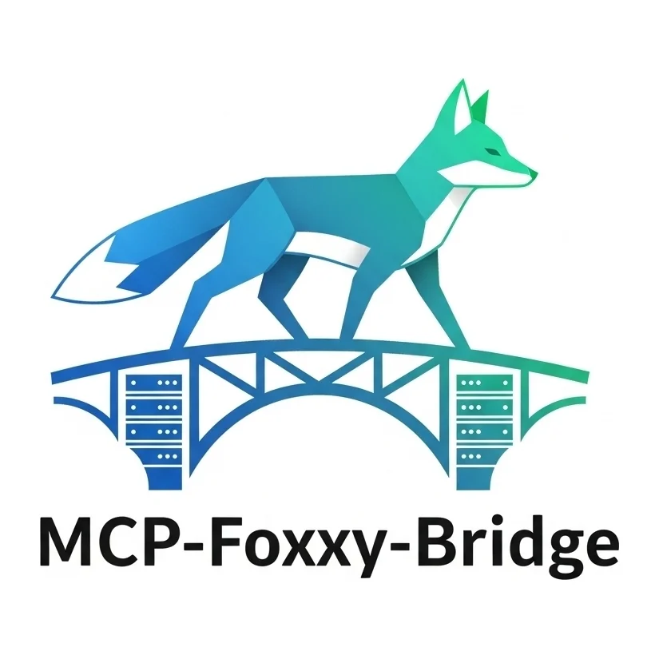

# MCP Foxxy Bridge

[](https://github.com/billyjbryant/mcp-foxxy-bridge/actions)
[](https://github.com/billyjbryant/mcp-foxxy-bridge/releases)
[](https://badge.fury.io/py/mcp-foxxy-bridge)
[](https://www.python.org/downloads/)
[](https://www.gnu.org/licenses/agpl-3.0)

<p align="center">
  
</p>

## Overview

**MCP Foxxy Bridge** is a one-to-many proxy for the Model Context Protocol (MCP). It lets you aggregate and route requests to multiple MCP servers through a single endpoint, so you can:

- Centralize configuration for all your MCP servers
- Expose all tools, resources, and prompts from connected servers
- Route requests transparently to the right backend
- Use a single MCP endpoint in your AI tools (Claude Desktop, VS Code, etc.)

---

## 🚀 Quickstart

See the [Installation Guide](docs/installation.md) for full details.

### 1. Choose one of the following installation methods:

**A. Install via uv (Recommended):**

```bash
uv tool install mcp-foxxy-bridge
```

**B. Install latest from GitHub:**

```bash
uv tool install git+https://github.com/billyjbryant/mcp-foxxy-bridge
```

**C. Run with Docker (from GHCR):**

```bash
docker run --rm -p 8080:8080 ghcr.io/billyjbryant/mcp-foxxy-bridge:latest --bridge-config /app/config.json
```

---

### 2. Run the Bridge

**With config file:**

```bash
mcp-foxxy-bridge --bridge-config config.json
```

**Or with named servers:**

```bash
mcp-foxxy-bridge --port 8080 \
  --named-server fetch 'uvx mcp-server-fetch' \
  --named-server github 'npx -y @modelcontextprotocol/server-github' \
  --named-server filesystem 'npx -y @modelcontextprotocol/server-filesystem'
```

See [Configuration Guide](docs/configuration.md) for config file examples.

---

### 3. Connect Your AI Tool

Point your MCP-compatible client to:

```
http://localhost:8080/sse
```

See [API Reference](docs/api.md) for integration details.

---

## 📚 Documentation

- [Overview & Features](docs/README.md)
- [Installation Guide](docs/installation.md)
- [Configuration Guide](docs/configuration.md)
- [Deployment Guide](docs/deployment.md)
- [API Reference](docs/api.md)
- [Architecture Overview](docs/architecture.md)
- [Troubleshooting Guide](docs/troubleshooting.md)
- [Example Configurations](docs/examples/README.md)

---

## 🛠️ Development

- [Development Setup](docs/README.md#development)
- [Contributing Guide](CONTRIBUTING.md)

---

## 🤝 Contributing & Support

- [Contributing Guide](CONTRIBUTING.md)
- [Issue Tracker](https://github.com/billyjbryant/mcp-foxxy-bridge/issues)
- [Discussions](https://github.com/billyjbryant/mcp-foxxy-bridge/discussions)

---

## ⚖️ License

This project is licensed under the GNU Affero General Public License v3.0 or later (AGPLv3+). See the [LICENSE](LICENSE) file for details.

---
