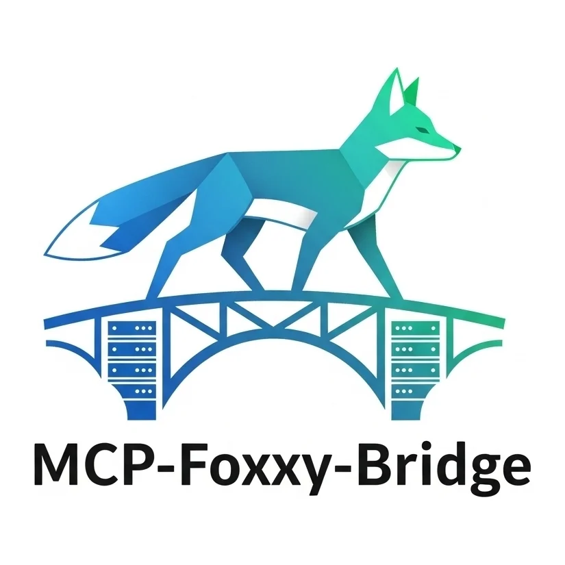

# MCP Foxxy Bridge

<!-- BADGIE TIME -->

[](https://github.com/billyjbryant/mcp-foxxy-bridge/actions/workflows/main.yml)
[](https://github.com/billyjbryant/mcp-foxxy-bridge/releases)
[](https://pypi.org/project/mcp-foxxy-bridge/)
[](https://codecov.io/gh/billyjbryant/mcp-foxxy-bridge)

[](https://pypi.org/project/mcp-foxxy-bridge/)
[](https://github.com/billyjbryant/mcp-foxxy-bridge/blob/main/LICENSE)
[](https://pypi.org/project/mcp-foxxy-bridge/)

[](https://pypi.org/project/mcp-foxxy-bridge/)
[](https://github.com/billyjbryant/mcp-foxxy-bridge/stargazers)
[](https://github.com/billyjbryant/mcp-foxxy-bridge/issues)
[](https://github.com/billyjbryant/mcp-foxxy-bridge/network/members)

[](https://github.com/pre-commit/pre-commit)
[](https://github.com/billyjbryant/mcp-foxxy-bridge/tree/main/docs)
[](https://modelcontextprotocol.io)
[](https://www.uvicorn.org/)

<!-- END BADGIE TIME -->

<p align="center">
  
</p>

## Overview

**MCP Foxxy Bridge** is a secure one-to-many proxy for the Model Context Protocol (MCP). Connect multiple MCP servers through a single endpoint with enterprise-grade security.

### ✨ Key Benefits

- **🔌 Single Endpoint**: Access all your MCP servers through one connection point
- **🛡️ Enterprise Security**: OAuth 2.0 + PKCE authentication with configurable SSL verification
- **⚡ Easy Setup**: Simple configuration with environment variable support
- **🔀 Smart Routing**: Automatic request routing to the right backend server
- **🏠 Secure by Default**: Localhost-only binding, SSL verification enabled, and comprehensive input validation
- **🚀 HTTP/2 Support**: Automatic protocol upgrade for improved performance

### 🎯 Perfect For

- Connecting multiple MCP servers to Claude Desktop, VS Code, or other AI tools
- Centralizing credential management with secure command substitution
- Production deployments requiring OAuth authentication
- Development environments with multiple data sources

---

## 🚀 Quickstart

See the [Installation Guide](docs/installation.md) for full details.

### 1. Choose one of the following installation methods

**A. Install via uv (Recommended):**

```bash
uv tool install mcp-foxxy-bridge
```

**B. Install latest from GitHub:**

```bash
uv tool install git+https://github.com/billyjbryant/mcp-foxxy-bridge
```

**C. Run with Docker (from GHCR):**

```bash
docker run --rm -p 8080:8080 ghcr.io/billyjbryant/mcp-foxxy-bridge:latest --bridge-config /app/config.json
```

---

### 2. Run the Bridge

**With config file:**

```bash
mcp-foxxy-bridge --bridge-config config.json
```

**Or with named servers:**

```bash
mcp-foxxy-bridge --port 8080 \
  --named-server fetch 'uvx mcp-server-fetch' \
  --named-server github 'npx -y @modelcontextprotocol/server-github' \
  --named-server filesystem 'npx -y @modelcontextprotocol/server-filesystem'

# With security features
mcp-foxxy-bridge --bridge-config config.json \
  --allow-command-substitution  # Enable secure command substitution
```

See [Configuration Guide](docs/configuration.md) for config file examples.

---

### 3. Connect Your AI Tool

Point your MCP-compatible client to:

```
http://localhost:8080/sse
```

See [API Reference](docs/api.md) for integration details.

---

## 📚 Documentation

### 🚀 Getting Started
- [📖 Documentation Overview](docs/README.md) - Start here for a complete guide
- [⬇️ Installation Guide](docs/installation.md) - Multiple installation methods
- [⚙️ Configuration Guide](docs/configuration.md) - Configure your setup
- [🎯 Example Configurations](docs/examples/README.md) - Ready-to-use config files

### 🔧 Advanced Usage
- [🚀 Deployment Guide](docs/deployment.md) - Docker, production deployments
- [🔌 API Reference](docs/api.md) - Programmatic integration
- [🏗️ Architecture Overview](docs/architecture.md) - Technical deep dive

### 🛡️ Security & Production
- [🔒 Security Guide](docs/security.md) - Comprehensive security practices
- [🔐 OAuth Authentication](docs/oauth.md) - Enterprise authentication setup

### 🆘 Support
- [🔧 Troubleshooting Guide](docs/troubleshooting.md) - Common issues and solutions
- [🤝 Contributing Guide](CONTRIBUTING.md) - Development setup and guidelines

---

## 🛠️ Development

- [Development Setup](docs/README.md#development)
- [Contributing Guide](CONTRIBUTING.md)

---

## 🤝 Contributing & Support

- [Contributing Guide](CONTRIBUTING.md)
- [Issue Tracker](https://github.com/billyjbryant/mcp-foxxy-bridge/issues)
- [Discussions](https://github.com/billyjbryant/mcp-foxxy-bridge/discussions)

---

## 🔒 Security

MCP Foxxy Bridge is built with security-first principles:

### 🛡️ Defense in Depth
- **🏠 Secure by Default**: Localhost-only binding (`127.0.0.1:8080`)
- **🔐 OAuth 2.0 + PKCE**: Enterprise authentication with configurable SSL verification
- **🔒 SSL/TLS Security**: SSL verification enabled by default, HTTP/2 support
- **⚡ Command Validation**: Allow-list based command substitution with shell injection protection
- **🔍 Input Validation**: Comprehensive validation of all parameters and arguments

### 🚨 Quick Security Setup
```bash
# Secure defaults (recommended)
mcp-foxxy-bridge --bridge-config config.json

# With command substitution (be careful!)
mcp-foxxy-bridge --bridge-config config.json --allow-command-substitution

# Production with OAuth
mcp-foxxy-bridge --bridge-config production-config.json
```

### 📋 Security Checklist
- ✅ Keep localhost binding for local development
- ✅ Use OAuth for production deployments
- ✅ Enable command substitution only when needed
- ✅ Review and audit your server configurations
- ✅ Monitor access logs regularly

**📖 For complete security guidance, see our [Security Guide](docs/security.md) and [OAuth Documentation](docs/oauth.md).**

---

## ⚖️ License

This project is licensed under the GNU Affero General Public License v3.0 or later (AGPLv3+). See the [LICENSE](LICENSE) file for details.

---
